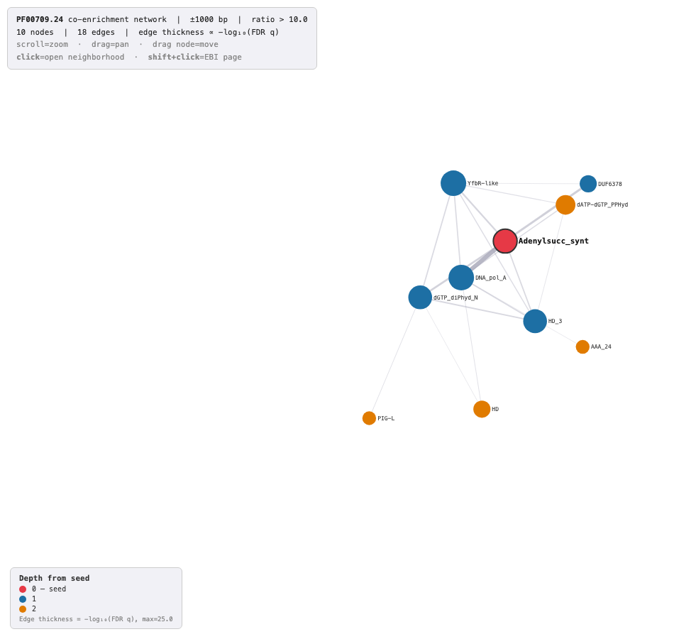
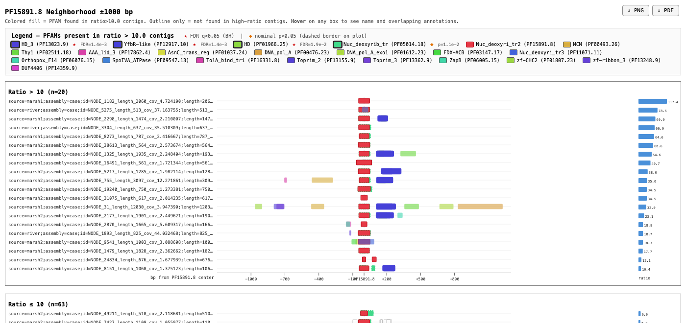

# metaGPA

Tools for exploring PFAM domain co-enrichment in ratio-labeled contig annotations
(e.g. hmmscan/hmmsearch `domtblout` output from a metaGPA-style enrichment screen).

## Scripts

### `create_pfam_network.py` (main entry point)

Builds an interactive co-enrichment network around a seed PFAM domain and, for
every node in that network, a linked neighborhood plot. Output is a folder of
HTML files — click a node in `network.html` to open its neighborhood plot.

```
python create_pfam_network.py <tab_file> <pfam_id> <window_bp> <ratio_cutoff> [max_depth]
```

Example:

```
python create_pfam_network.py data.tab PF05014.22 1000 10 3
```

- `tab_file` — hmmscan/hmmsearch-style domain table (whitespace-delimited).
- `pfam_id` — seed PFAM accession, e.g. `PF05014.22`.
- `window_bp` — ± window (bp) around the seed domain to look for neighboring domains.
- `ratio_cutoff` — contigs with ratio at or above this are "high-ratio"; used for enrichment testing.
- `max_depth` — optional, default `3`. How many recursive hops from the seed to follow when
  expanding the network.

Output is written to a folder next to `tab_file` named
`<tab_basename>_<pfam_id>_w<window>_r<ratio>_d<depth>_linked/`, containing:

- `network.html` — the co-enrichment network.
- `neighborhood_PF*.html` — one neighborhood plot per network node.

### `pfam_coenrichment_network.py`

Standalone version of the network builder (used internally by `create_pfam_network.py`).
Can also be run directly to produce just `network.html` (its node clicks link to EBI
instead of local neighborhood pages):

```
python pfam_coenrichment_network.py <tab_file> <pfam_id> <window_bp> <ratio_cutoff> [max_depth]
```

### `plot_pfam_neighborhood.py`

Standalone version of the neighborhood plot for a single PFAM domain:

```
python plot_pfam_neighborhood.py <tab_file> <pfam_id> <window_bp> <ratio_cutoff>
```

### `get_proteins.py`

Extracts the amino-acid sequence for every hit of a PFAM domain, ranked from
highest to lowest contig ratio, as a FASTA file. If two or more hits produce
the exact same sequence, only the highest-ratio instance is kept.

```
python get_proteins.py <tab_file> <faa_file> <pfam_id> [ratio_cutoff] [--domain_only|--full_length] [--include_truncated]
```

Example:

```
python get_proteins.py data.tab proteins.faa PF00709.24 10 --domain_only
```

- `tab_file` — same domain table used by the other scripts.
- `faa_file` — protein FASTA matching the hmmer output's contig IDs (see [Input format](#input-format)).
- `pfam_id` — PFAM accession to extract, e.g. `PF00709.24`.
- `ratio_cutoff` — optional. Only include contigs with ratio at or above this value.
Since `faa_file` is a raw frame translation (not called ORFs) and contains `*` stop
codons, the ORF around the domain is located as: start = first `M` after the nearest
upstream stop codon, end = the nearest downstream stop codon (exclusive). This check
applies in both modes below — if the domain's surrounding ORF isn't flanked by a stop
codon on one or both sides, that hit is skipped by default; pass `--include_truncated`
to keep it (best-effort boundary) with `(truncated)` noted in its header.

- `--domain_only` (default) — output just the aligned domain span (still requires the
  surrounding ORF to be stop-codon-flanked, per above).
- `--full_length` — output the full ORF span instead of just the domain.

Output is written next to `tab_file` as
`<tab_basename>_<pfam_id>[_r<ratio_cutoff>]_<domain_only|full_length>.fasta`.

### `build_pfam_tree.py`

Builds a MAFFT alignment and FastTree phylogeny for a PFAM domain, plus a mapping
file for coloring the tree by enrichment ratio. Reuses `get_proteins.py`'s extraction
logic, but — unlike `get_proteins.py` — includes every hit regardless of ratio
(duplicates are still removed); `ratio_cutoff` is used only to color each leaf as
"selected" (ratio ≥ cutoff) or "unselected", not to filter which hits are included.

```
python build_pfam_tree.py <tab_file> <faa_file> <pfam_id> <ratio_cutoff> [--domain_only|--full_length] [--include_truncated]
```

Example:

```
python build_pfam_tree.py data.tab proteins.faa PF00709.24 10 --domain_only
```

- `tab_file`, `faa_file`, `pfam_id` — same as `get_proteins.py`.
- `ratio_cutoff` — required. Hits with ratio ≥ this are colored "selected"; below it,
  "unselected". Does not filter which sequences are included.
- `--domain_only` / `--full_length` / `--include_truncated` — same as `get_proteins.py`.

Each unique sequence gets an ID of the form `<S|unselected>_<n>_<ratio>` (e.g.
`S_1_17.7`, `unselected_9_4.3`) — unique, used as-is in the FASTA, alignment, tree,
and mapping file. Output is written to a folder next to `tab_file` named
`<tab_basename>_<pfam_id>_r<ratio_cutoff>_<domain_only|full_length>_tree/`, containing:

- `sequences.fasta` — unaligned, deduplicated sequences.
- `aligned.fasta` — MAFFT alignment (`mafft --maxiterate 2 --localpair`).
- `tree.nwk` — FastTree phylogeny (`FastTree -gamma`), built from the alignment.
- `mapping.txt` — tab-separated `name`, `leaf_dot_color`, `leaf_label_color`,
  `bar1_height`, `bar1_gradient` columns for annotating the tree: selected leaves get
  `bp_green`/`ptm_rose`, unselected get `k_grey`/`ptm_sand`; `bar1_height` is the
  contig's ratio.

Requires `mafft` and `FastTree` (or `fasttree`) on `PATH` — see [Dependencies](#dependencies).

## Example

```
python create_pfam_network.py data.tab PF00709.24 1000 10 2
```

`PF00709` (Adenylsucc_synt) is the seed domain (red). Nodes found by direct
co-enrichment with the seed are depth 1 (blue); nodes found by recursing one
more hop are depth 2 (orange). Edge thickness reflects −log₁₀(FDR q) of the
co-enrichment test:



Clicking any node in the real (interactive) `network.html` opens that node's
`neighborhood_PF*.html` — a plot of that domain's own neighborhood across
high- vs. low-ratio contigs. For example, clicking the `PF15891` node (or
running `plot_pfam_neighborhood.py` directly on it) shows every contig
containing that domain, colored by which neighboring PFAMs they carry, split
into high-ratio and low-ratio panels and ranked by ratio:

```
python plot_pfam_neighborhood.py data.tab PF15891.8 1000 10
```



## How it works

Contigs are matched by name against `^(.+?_ratio_[\d.]+)-\d+[FR]$`, so each contig's
ratio is parsed straight out of its ID. For a given PFAM domain, contigs are split into
"high-ratio" (`ratio >= ratio_cutoff`) and "low-ratio" groups. For every other PFAM found
within `window_bp` of the reference domain, a Fisher's exact test (BH-FDR corrected,
q < 0.05) checks whether it's enriched in the high-ratio group. `create_pfam_network.py`
recurses this process outward from the seed domain up to `max_depth` hops, building a graph
of significant co-enrichment relationships.

## Input format

Whitespace-delimited domain table (e.g. hmmscan `--domtblout`) with at least 19 columns:

- column 1: contig/sequence ID, must match `<name>_ratio_<float>-<index><F|R>`
- column 4: PFAM domain name
- column 5: PFAM accession (e.g. `PF00005.30`)
- columns 18–19: alignment start/end coordinates (amino-acid positions on the query
  sequence identified in column 1 — not contig base-pair positions)

`get_proteins.py` additionally needs a standard FASTA (`.faa`, `>id` header + sequence,
optionally wrapped) with one record per column-1 ID from the hmmer output — e.g. a 3-/6-frame
translation of each contig, which is why sequences may contain `*` stop codons (see
`--full_length` above).

## Dependencies

```
pip install scipy statsmodels requests
```

`d3.min.js` is vendored in this repo; if missing, `pfam_coenrichment_network.py` will
download it from cdnjs on first run (requires `requests` and network access).

`get_proteins.py` uses only the standard library — no extra dependencies.

`build_pfam_tree.py` additionally requires [MAFFT](https://mafft.cbrc.jp/alignment/software/)
and [FastTree](http://www.microbesonline.org/fasttree/) on `PATH`, e.g.:

```
conda install -c bioconda mafft fasttree
```
